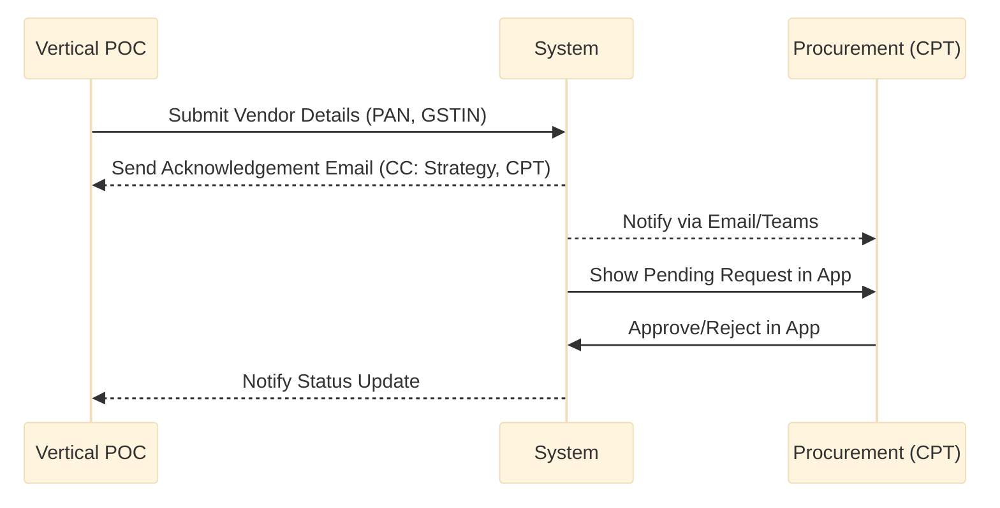
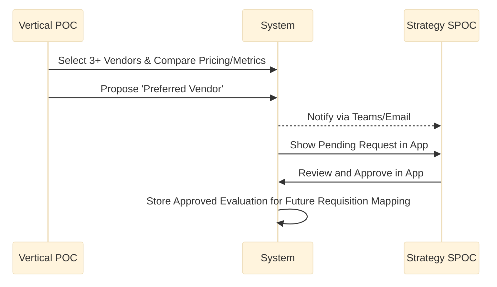
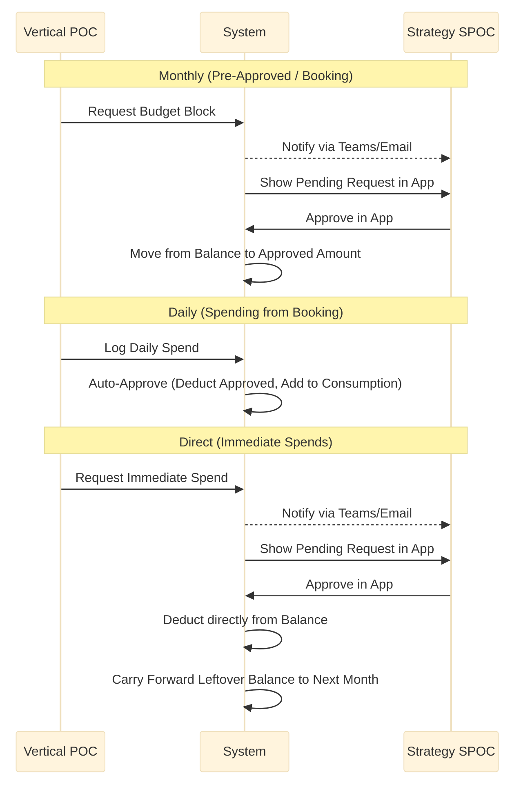
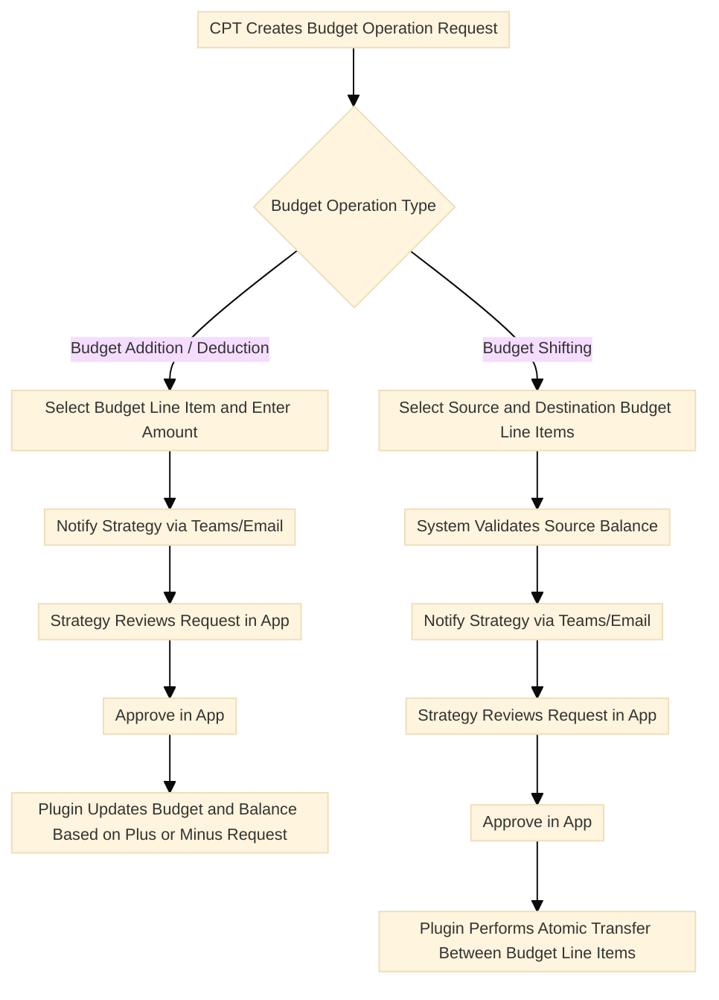
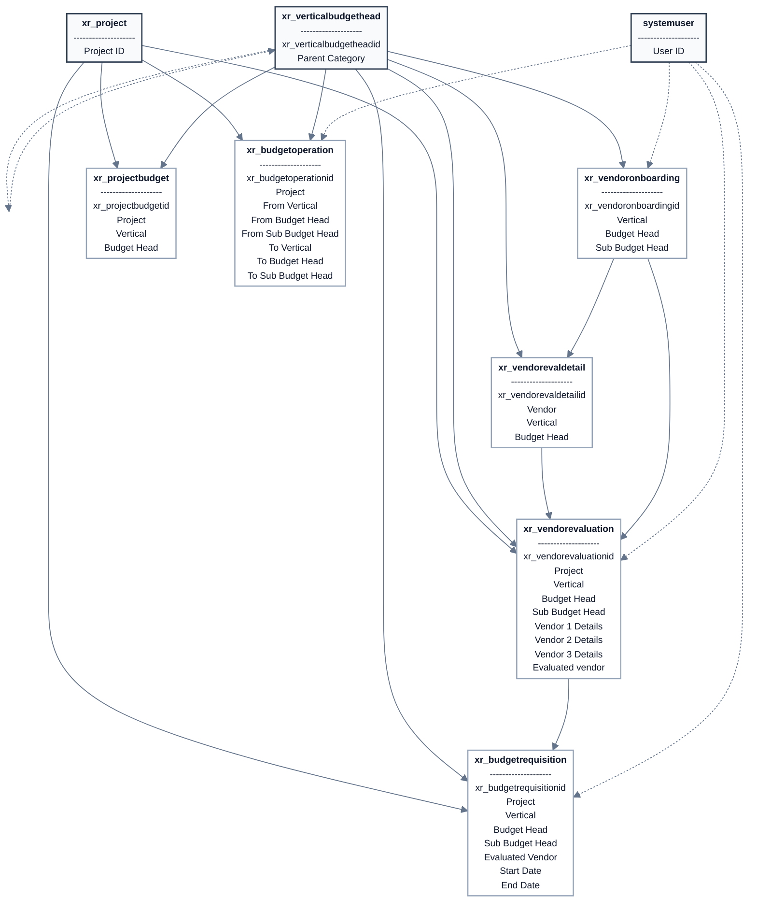

# Chanakya 2.0: Model-Driven App Flow & Architecture

This document explains the complete end-to-end workflow of the new Chanakya Model-Driven App (Power Apps). It breaks down user roles, step-by-step module flows, data storage (Dataverse tables), and how approvals are handled.

---

## 1. User Roles & Access

The application serves four primary personas. Access to specific records and forms will be controlled via Dataverse Security Roles and Business Units.

| Role                          | Interface                   | Primary Responsibilities                                                                                    | Dataverse Security Role                   |
| :---------------------------- | :-------------------------- | :---------------------------------------------------------------------------------------------------------- | :---------------------------------------- |
| **Tech Admin**                | Dataverse Backend           | Uploads the master project-wise budget data into the system.                                                | System Administrator                      |
| **Vertical POC**              | Chanakya App                | Executes operations: onboards vendors, runs vendor evaluations, requests expenses, and burns budget.        | Custom Role based on Vertical Job Profile |
| **CPT (Central Procurement)** | Chanakya App                | Reviews and approves vendor onboarding. Initiates budget operations (addition, shifting, deduction).        | CPT Approval Role                         |
| **Strategy (SPOC)**           | Strategy App / Chanakya App | Primary financial decision maker. Approves Vendor Evaluations, Expense Requisitions, and Budget Operations. | Strategy Manager                          |

### Role Provisioning & Access Handling

- **Strategy (SPOC):** Already present through the `Strategy Approval` mapping in the Project table and assigned the `Strategy Manager` security role.
- **Vertical POC:** Will be created through a choice set in the Team Onboarding table's `Job Profile` column, with separate security roles for each vertical profile.
- **CPT (Central Procurement):** Will be created through a `CPT Approval` column in the Project table, along with a dedicated CPT security role.
- **Tech Admin:** Already present as the standard `System Administrator` role.

---

## 2. Complete Application Flow by Module

> **Approval Principle:** All approvals are completed inside the Model-Driven App experience (Chanakya App / Strategy App). Emails and Teams messages are used only for notification, reminders, and routing visibility.

### Module 0: Initial Budget Upload (Setup)

- **Actor:** Tech Admin
- **Interface:** Dataverse Backend / Data Import Wizard
- **Action:** The Tech Admin uploads the master project budget into the system.
- **Data Storage:** Data is populated into the **`xr_projectbudget`** table. This defines the baseline `Budget (Allocated Amount)` available for each combination of Project, Vertical, and Budget Head.

### Module 1: Vendor Onboarding

- **Actor:** Vertical POC (Initiator) -> CPT (Approver)
- **Action:** The Vertical POC fills out a form to add a new vendor to the system, providing PAN, GSTIN, and contact info. No pricing is discussed at this stage.
- **Data Storage:** A new record is created in the **`xr_vendoronboarding`** table with the `Approval Status` set to `Pending`.
- **Approval Flow:**
  1. A Power Automate flow triggers upon record creation and sends an acknowledgement email to the Vertical POC, CC'ing the Strategy SPOC and CPT.
  2. The pending onboarding request appears in the Chanakya App for CPT review.
  3. CPT logs into the Chanakya App, navigates to pending onboardings, and Approves/Rejects the vendor in-app.
  4. The `Approval Status` in **`xr_vendoronboarding`** is updated to `Approved`.

**Visual Flow:**

### Module 2: Vendor Evaluation

- **Actor:** Vertical POC (Initiator) -> Strategy (Approver)
- **Action:** To finalize a vendor for a specific service bucket, the Vertical POC compares at least 3 approved vendors, inputs their commercial pricing and performance metrics, and proposes a 'Preferred Vendor'.
- **Data Storage:**
  - **`xr_vendorevaluation`** (Header Table): Stores the overall evaluation context (Project, Vertical, Sub Budget Head) and the proposed Preferred Vendor.
  - **`xr_vendorevaldetail`** (Detail Table): Up to 3 child records are created and linked to the Header, capturing the specific metrics, ratings, and pricing for each compared vendor.
- **Approval Flow:**
  1. System generates an Evaluation Request and sets status to 'Pending' / 'In Progress'.
  2. Power Automate identifies the appropriate Strategy SPOC from the `xr_project` mapping, sends a Teams/Email notification, and surfaces the pending request in the app.
  3. Strategy reviews the details and approves/rejects the request through the Strategy App (or Chanakya App).
  4. Upon Approval, the selected vendor's GUID is populated into the `Evaluated vendor` lookup column of the **`xr_vendorevaluation`** table. This approved evaluation record becomes the reference used in later expense requisitions for the same Project, Vertical, Budget Head, and Sub Budget Head context.

**Visual Flow:**

### Module 3: Budget / Expense Requisition

- **Actor:** Vertical POC (Initiator) -> Strategy (Approver for new funds)
- **Action:** The Vertical POC requests to spend the allocated budget using the approved vendor evaluation for the same Project, Vertical, Budget Head, and Sub Budget Head context.
- **Data Storage:** A new record is created in the **`xr_budgetrequisition`** table, storing the GUID of the approved **`xr_vendorevaluation`** record for that context. Upon approval, values in the parent **`xr_projectbudget`** table are recalculated.
- **Flow Variations:**
  - **Monthly (Pre-Approved / Booking):** Vertical POC requests a block of money for a set period. _Approval required by Strategy._ Once approved, the amount moves from `Balance (In Rs)` (Available Balance) to `Approved Amount` in `xr_projectbudget`.
  - **Daily (Spending from Booking):** Vertical POC burns down their monthly booking as actual daily spend occurs. _No Strategy approval required_ (auto-approved if within the booked limit). The amount is deducted from `Approved Amount` and added to `Consumption` in `xr_projectbudget`.
  - **Direct (One-off Immediate Spends):** Vertical POC requests an immediate, unbooked spend. _Approval required by Strategy._ Once approved, the amount passes `Approved Amount` entirely, deducting directly from `Balance (In Rs)` and adding to `Consumption`.
- **Backend Logic (The Double-Check):** Complex transaction validations and balance calculations will be handled via **Backend Plugins**. For example, a plugin will verify the `Balance (In Rs)` right before the Strategy clicks "Approve" (to prevent race conditions leading to negative balances). Note: Any remaining balance by the month's end will be added to the next month's budget.

**Visual Flow:**

### Module 4: Budget Operation Request (Addition, Shifting & Deduction)

- **Actor:** CPT (Initiator) -> Strategy (Approver)
- **Action:** CPT manages requests to inject new funds from the developer, shift existing funds across verticals/budget heads within the _same_ project, or deduct budget from an existing budget line item.
- **Data Storage:** A record is created in the **`xr_budgetoperation`** table capturing the 'From' and/or 'To' context and the `Amount` to be altered.
- **Flow Variations:**
  - **Budget Addition / Deduction:** CPT selects the relevant budget line item and enters the amount. Strategy is notified and approves it in-app. Backend plugins update the target **`xr_projectbudget`** record by increasing or reducing the amount in a controlled manner based on the request type.
  - **Budget Shifting:** CPT selects a source ('From') and destination ('To') budget line item. The system validates that the source has sufficient balance. Strategy then approves the request in-app. Plugins atomically deduct the amount from the source's **`xr_projectbudget`** record and add it to the destination's record.
- **Backend Impact:** For any approved budget operation, the corresponding **`xr_projectbudget`** record(s) are updated in the `Budget (Allocated Amount)` and `Balance (In Rs)` fields. All related calculations and update logic are handled through backend plugins.

**Visual Flow:**

---

## 3. Automation & System Architecture Summary

- **UI/Frontend:** The operations run on Model-Driven Apps (Chanakya App for execution, Strategy App for approvals), providing robust forms, subgrids, and view-based navigation.
- **Approval Experience:** All approval decisions are taken inside the app. Approvers use app views, forms, and command actions to review and approve/reject records.
- **Database:** Dataverse manages relational integrity. Business rules on forms will guide UI behavior (showing/hiding fields based on Context or Type).
- **Calculations & Validation (Plugins):** Complex math (Consumption Percentages, Re-credits) and critical security logic (Concurrency double-checks on financial limits) are enforced securely in the backend via C# Plugins.
- **Notifications & Routing (Power Automate):** Cloud flows trigger on record creations and status changes to send Teams/Outlook notifications and reminders. These flows do not collect approvals; they only alert users that action is pending in the app.

---

## 4. Table Schema Summary

The application utilizes the following core Dataverse tables to manage the business logic:

### 0.1 `systemuser`

Standard Dataverse user table acting as Approvers and Requestors.

### 0.2 `xr_project`

Master reference for the project identity used across the app.
It anchors budget, evaluation, requisition, and budget operation records.

### 1. `xr_verticalbudgethead` (Vertical Budget Head)

Shared hierarchy for Vertical, Budget Head, and Sub Budget Head.
This table drives structure, filtering, and lookup behavior across all transactional modules.

### 2. `xr_projectbudget` (Project Budget)

Core financial table that stores the sanctioned budget bucket for each Project + category combination.
It is the main source for available balance, approved amount, and consumption values used by the budget workflows.

### 3. `xr_vendoronboarding` (Vendor Onboarding)

Central vendor repository created through the onboarding workflow.
It stores approved vendor identities and becomes the source for later evaluations and spend requests.

### 4. `xr_vendorevaluation` (Vendor Evaluation)

Header record for a vendor comparison event tied to a project and budget context.
It stores the decision context and the preferred/evaluated vendor after approval.

### 5. `xr_vendorevaldetail` (Vendor Eval Detail)

Child comparison records linked to a vendor evaluation header.
Each record captures one vendor's commercial and performance assessment, typically up to three per evaluation.

### 6. `xr_budgetrequisition` (Budget Requisition)

Operational request table for budget booking, direct spend, and daily consumption use cases.
It stores the approved vendor evaluation reference (Evaluated Vendor) for the same budget context and triggers balance movement back into the project budget ledger.

### 7. `xr_budgetoperation` (Budget Operation)

Administrative request table for budget addition, shifting, and deduction scenarios.
It captures source and destination context so plugins can apply controlled budget movements within a project.
