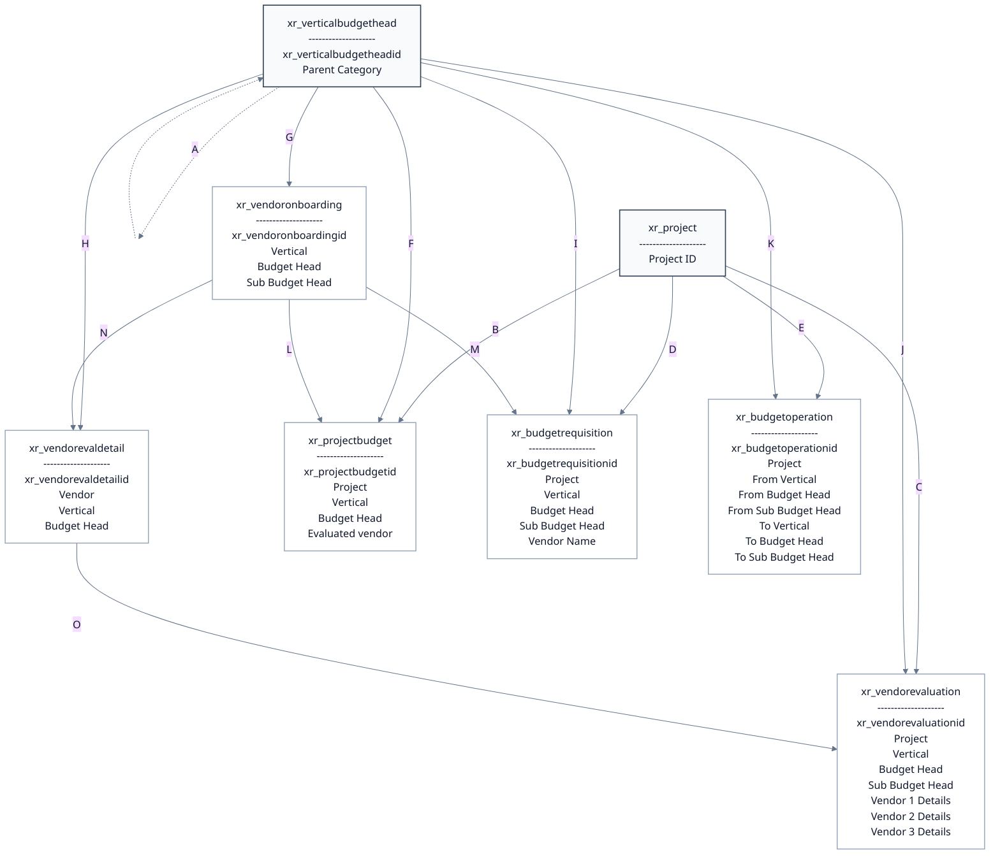

| Label | Relationship                                                                                                                                                                                                                                                                                                              |
| ----- | ------------------------------------------------------------------------------------------------------------------------------------------------------------------------------------------------------------------------------------------------------------------------------------------------------------------------- |
| A     | `xr_verticalbudgethead.Parent Category` looks up `xr_verticalbudgethead.xr_verticalbudgetheadid` (`1:n` self-relationship; each child category has `0..1` parent, and one parent category can have many children).                                                                                                        |
| B     | `xr_projectbudget.Project` looks up `xr_project.Project ID` (`1:n`).                                                                                                                                                                                                                                                      |
| C     | `xr_vendorevaluation.Project` looks up `xr_project.Project ID` (`1:n`).                                                                                                                                                                                                                                                   |
| D     | `xr_budgetrequisition.Project` looks up `xr_project.Project ID` (`1:n`).                                                                                                                                                                                                                                                  |
| E     | `xr_budgetoperation.Project` looks up `xr_project.Project ID` (`1:n`).                                                                                                                                                                                                                                                    |
| F     | `xr_projectbudget.Vertical` and `xr_projectbudget.Budget Head` each look up `xr_verticalbudgethead.xr_verticalbudgetheadid` (`1:n` per lookup).                                                                                                                                                                           |
| G     | `xr_vendoronboarding.Vertical`, `xr_vendoronboarding.Budget Head`, and `xr_vendoronboarding.Sub Budget Head` each look up `xr_verticalbudgethead.xr_verticalbudgetheadid` (`1:n` per lookup; `Sub Budget Head` is optional).                                                                                              |
| H     | `xr_vendorevaldetail.Vertical` and `xr_vendorevaldetail.Budget Head` each look up `xr_verticalbudgethead.xr_verticalbudgetheadid` (`1:n` per lookup).                                                                                                                                                                     |
| I     | `xr_budgetrequisition.Vertical`, `xr_budgetrequisition.Budget Head`, and `xr_budgetrequisition.Sub Budget Head` each look up `xr_verticalbudgethead.xr_verticalbudgetheadid` (`1:n` per lookup).                                                                                                                          |
| J     | `xr_vendorevaluation.Vertical`, `xr_vendorevaluation.Budget Head`, and `xr_vendorevaluation.Sub Budget Head` each look up `xr_verticalbudgethead.xr_verticalbudgetheadid` (`1:n` per lookup; `Sub Budget Head` is used if available).                                                                                     |
| K     | `xr_budgetoperation.From Vertical`, `From Budget Head`, `From Sub Budget Head`, `To Vertical`, `To Budget Head`, and `To Sub Budget Head` each look up `xr_verticalbudgethead.xr_verticalbudgetheadid` (`1:n` per lookup; `To*` fields apply to Budget Shifting, and sub-budget-head lookups are optional where defined). |
| L     | `xr_projectbudget.Evaluated vendor` looks up `xr_vendoronboarding.xr_vendoronboardingid` (`1:n`).                                                                                                                                                                                                                         |
| M     | `xr_budgetrequisition.Vendor Name` looks up `xr_vendoronboarding.xr_vendoronboardingid` (`1:n`).                                                                                                                                                                                                                          |
| N     | `xr_vendorevaldetail.Vendor` looks up `xr_vendoronboarding.xr_vendoronboardingid` (`1:n`).                                                                                                                                                                                                                                |
| O     | `xr_vendorevaluation.Vendor 1 Details`, `xr_vendorevaluation.Vendor 2 Details`, and `xr_vendorevaluation.Vendor 3 Details` each look up `xr_vendorevaldetail.xr_vendorevaldetailid` (`1:n` per lookup; logically one evaluation can hold up to 3 detail records).                                                         |
