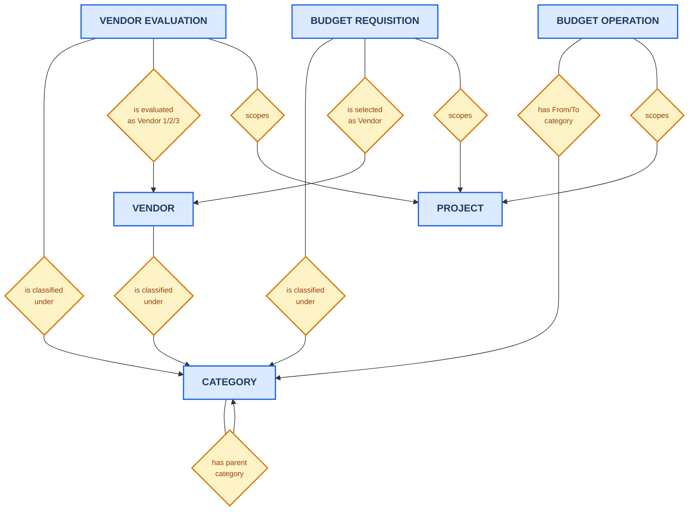

```mermaid
graph TD
    classDef entity fill:#dbeafe,stroke:#2563eb,stroke-width:2px,color:#1e3a5f,font-weight:bold
    classDef rel fill:#fef3c7,stroke:#d97706,stroke-width:2px,color:#92400e,font-size:12px

    CAT["CATEGORY"]:::entity
    PRJ["PROJECT"]:::entity
    VEN["VENDOR"]:::entity
    EVL["VENDOR EVALUATION"]:::entity
    REQ["BUDGET REQUISITION"]:::entity
    OPS["BUDGET OPERATION"]:::entity

    R1{"has parent\ncategory"}:::rel
    R2{"is classified\nunder"}:::rel
    R3{"is classified\nunder"}:::rel
    R4{"is classified\nunder"}:::rel
    R5{"has From/To\ncategory"}:::rel
    R6{"is evaluated\nas Vendor 1/2/3"}:::rel
    R7{"is selected\nas Vendor"}:::rel
    R8{"scopes"}:::rel
    R9{"scopes"}:::rel
    R10{"scopes"}:::rel

    CAT --- R1 --> CAT
    VEN --- R2 --> CAT
    EVL --- R3 --> CAT
    REQ --- R4 --> CAT
    OPS --- R5 --> CAT

    EVL --- R6 --> VEN
    REQ --- R7 --> VEN

    EVL --- R8 --> PRJ
    REQ --- R9 --> PRJ
    OPS --- R10 --> PRJ
```
