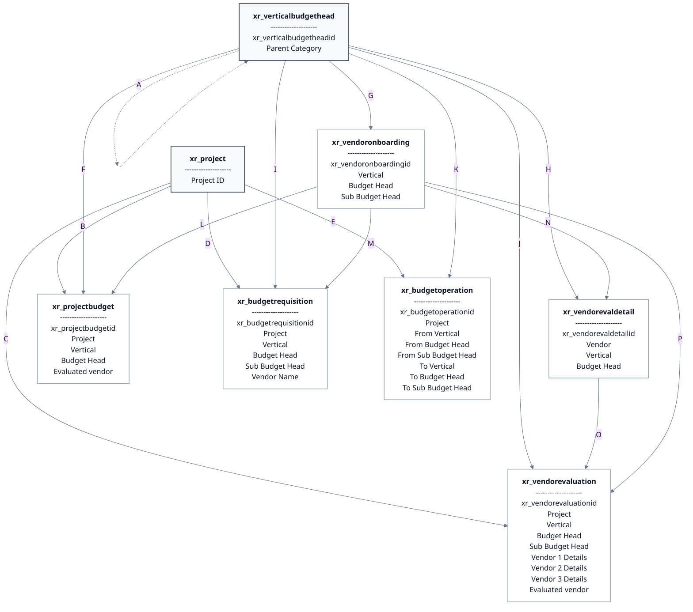

| Label | Relationship                                                                                                                                                                                                                                                                                                              |
| ----- | ------------------------------------------------------------------------------------------------------------------------------------------------------------------------------------------------------------------------------------------------------------------------------------------------------------------------- |
| A     | <b>xr_verticalbudgethead</b>.Parent Category looks up <b>xr_verticalbudgethead</b>.xr_verticalbudgetheadid (`1:n` self-relationship; each child category has `0..1` parent, and one parent category can have many children).                                                                                           |
| B     | <b>xr_projectbudget</b>.Project looks up <b>xr_project</b>.Project ID (`1:n`).                                                                                                                                                                                                                                           |
| C     | <b>xr_vendorevaluation</b>.Project looks up <b>xr_project</b>.Project ID (`1:n`).                                                                                                                                                                                                                                        |
| D     | <b>xr_budgetrequisition</b>.Project looks up <b>xr_project</b>.Project ID (`1:n`).                                                                                                                                                                                                                                       |
| E     | <b>xr_budgetoperation</b>.Project looks up <b>xr_project</b>.Project ID (`1:n`).                                                                                                                                                                                                                                         |
| F     | <b>xr_projectbudget</b>.Vertical and <b>xr_projectbudget</b>.Budget Head each look up <b>xr_verticalbudgethead</b>.xr_verticalbudgetheadid (`1:n` per lookup).                                                                                                                                                         |
| G     | <b>xr_vendoronboarding</b>.Vertical, <b>xr_vendoronboarding</b>.Budget Head, and <b>xr_vendoronboarding</b>.Sub Budget Head each look up <b>xr_verticalbudgethead</b>.xr_verticalbudgetheadid (`1:n` per lookup; `Sub Budget Head` is optional).                                                                     |
| H     | <b>xr_vendorevaldetail</b>.Vertical and <b>xr_vendorevaldetail</b>.Budget Head each look up <b>xr_verticalbudgethead</b>.xr_verticalbudgetheadid (`1:n` per lookup).                                                                                                                                                   |
| I     | <b>xr_budgetrequisition</b>.Vertical, <b>xr_budgetrequisition</b>.Budget Head, and <b>xr_budgetrequisition</b>.Sub Budget Head each look up <b>xr_verticalbudgethead</b>.xr_verticalbudgetheadid (`1:n` per lookup).                                                                                                  |
| J     | <b>xr_vendorevaluation</b>.Vertical, <b>xr_vendorevaluation</b>.Budget Head, and <b>xr_vendorevaluation</b>.Sub Budget Head each look up <b>xr_verticalbudgethead</b>.xr_verticalbudgetheadid (`1:n` per lookup; `Sub Budget Head` is used if available).                                                            |
| K     | <b>xr_budgetoperation</b>.From Vertical, From Budget Head, From Sub Budget Head, To Vertical, To Budget Head, and To Sub Budget Head each look up <b>xr_verticalbudgethead</b>.xr_verticalbudgetheadid (`1:n` per lookup; `To*` fields apply to Budget Shifting, and sub-budget-head lookups are optional where defined). |
| L     | <b>xr_projectbudget</b>.Evaluated vendor looks up <b>xr_vendoronboarding</b>.xr_vendoronboardingid (`1:n`).                                                                                                                                                                                                            |
| M     | <b>xr_budgetrequisition</b>.Vendor Name looks up <b>xr_vendoronboarding</b>.xr_vendoronboardingid (`1:n`).                                                                                                                                                                                                             |
| N     | <b>xr_vendorevaldetail</b>.Vendor looks up <b>xr_vendoronboarding</b>.xr_vendoronboardingid (`1:n`).                                                                                                                                                                                                                   |
| O     | <b>xr_vendorevaluation</b>.Vendor 1 Details, <b>xr_vendorevaluation</b>.Vendor 2 Details, and <b>xr_vendorevaluation</b>.Vendor 3 Details each look up <b>xr_vendorevaldetail</b>.xr_vendorevaldetailid (`1:n` per lookup; logically one evaluation can hold up to 3 detail records).                                |
| P     | <b>xr_vendorevaluation</b>.Evaluated vendor looks up <b>xr_vendoronboarding</b>.xr_vendoronboardingid (`1:n`).                                                                                                                                                                                                         |
